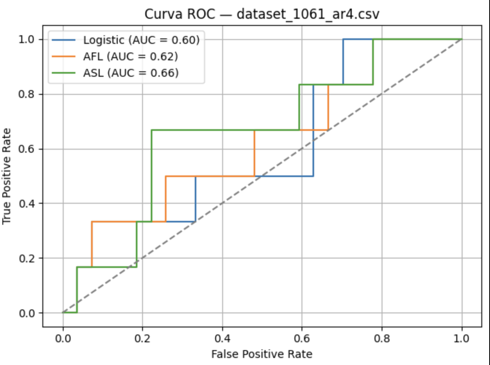
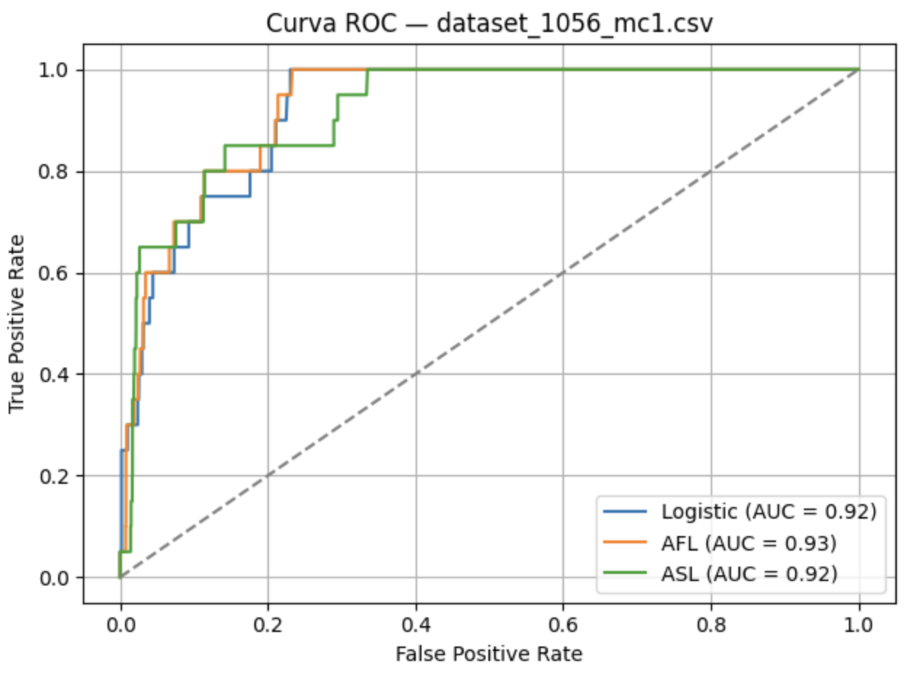
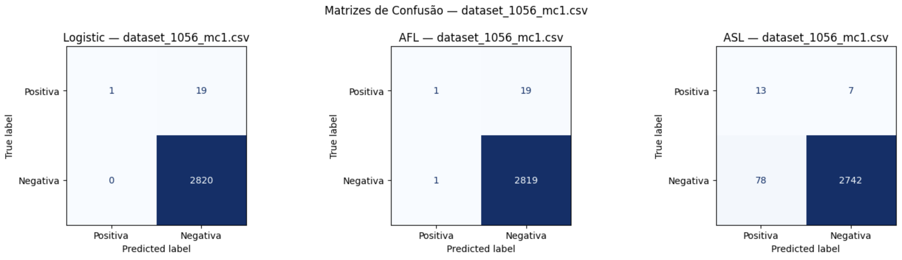
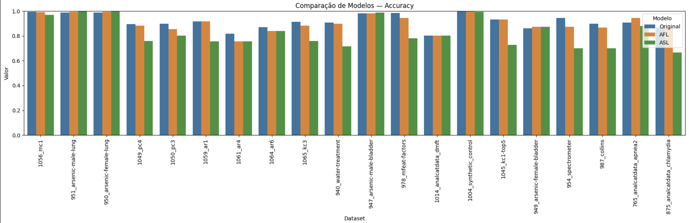
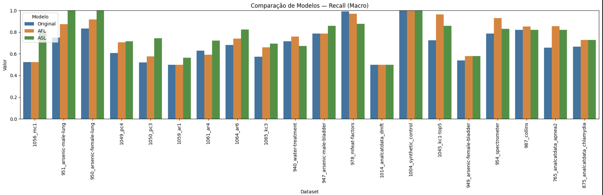
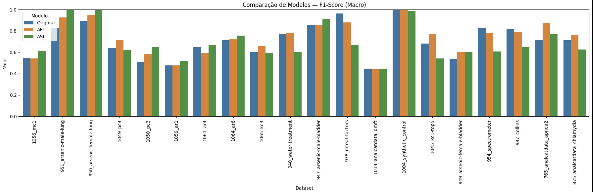
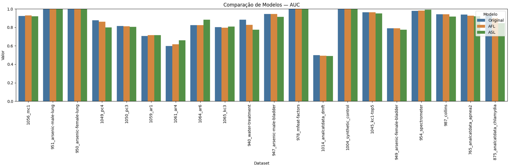
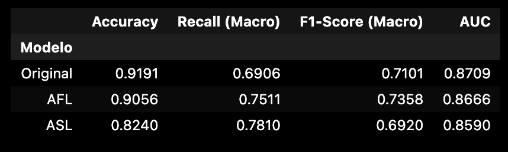

# ML1 — Logistic Regression *from scratch* and Learning with Imbalanced Data

Practical assignment for **Machine Learning I (CC2008, 2024/2025, FCUP)**.  
This repository contains a **from-scratch implementation** of Logistic Regression, an **experimental notebook**, and a **set of results** on the problem of **class imbalance** in binary classification. Variations of the loss function (**AFL — Asymmetric Focal Loss** and **ASL — Adaptive Sample Loss**) were applied and compared to the original model.

> Note: In `data/raw/` you will only find the **datasets actually used** in the experiments. The full package `class_imbalance.zip` provided by the instructors is **not** included.


## 📦 Repository structure

```
.
├── README.md
├── requirements.txt
├── .gitignore
├── src/
│   └── LogisticRegression.py        # logistic regression implementation (from scratch)
├── notebook/
│   └── Projeto ML1.ipynb            # final notebook with the full pipeline
├── data/
│   ├── raw/                         # CSVs used (20 datasets)
│   └── README.md                    # provenance and list of datasets
├── results/                         # representative subset of generated figures
│   ├── 1.jpeg  2.png  4.png  6.png  8.jpeg  9.jpeg  10.jpeg  11.jpeg  12.png
├── slides/
│   └── Projeto ML1.pdf              # presentation slides (PDF)

```


## 🎯 Objectives
- Implement **Logistic Regression** from scratch (without using `scikit-learn` estimators).  
- Study the effect of **class imbalance** on evaluation metrics.  
- **Modify the loss function** (AFL/ASL) and **compare** with the original model across **20 datasets**.


## 🧪 Datasets (used)
Source: `class_imbalance.zip` package provided by the course instructors.  
Only the following datasets were included:

- `dataset_1056_mc1.csv`
- `dataset_951_arsenic-male-lung.csv`
- `dataset_950_arsenic-female-lung.csv`
- `dataset_1049_pc4.csv`
- `dataset_1050_pc3.csv`
- `dataset_1059_ar1.csv`
- `dataset_1061_ar4.csv`
- `dataset_1064_ar6.csv`
- `dataset_1065_kc3.csv`
- `dataset_940_water-treatment.csv`
- `dataset_947_arsenic-male-bladder.csv`
- `dataset_978_mfeat-factors.csv`
- `dataset_1014_analcatdata_dmft.csv`
- `dataset_1004_synthetic_control.csv`
- `dataset_1045_kc1-top5.csv`
- `dataset_949_arsenic-female-bladder.csv`
- `dataset_954_spectrometer.csv`
- `dataset_987_collins.csv`
- `dataset_765_analcatdata_apnea2.csv`
- `dataset_875_analcatdata_chlamydia.csv`


## ⚙️ Environment

Requires **Python 3.11**. Install dependencies:

```bash
python -m venv .venv
# macOS/Linux
source .venv/bin/activate
# Windows (PowerShell)
# .venv\Scripts\Activate.ps1

pip install -r requirements.txt
```


## ▶️ How to reproduce

1) **Place the data**: make sure CSVs are in `data/raw/`.  
2) **Open the notebook**:
```bash
jupyter notebook notebook/Projeto\ ML1.ipynb
```
3) **Run all cells**: execute the notebook from top to bottom.  
   - The notebook loads datasets from `data/raw/`.  
   - Results (tables/plots) can be generated into `results/`.  

> The model code is in `src/LogisticRegression.py`. The AFL/ASL variants are implemented in the notebook/auxiliary functions and applied during training.


## 📈 Results (overview)

**Quantitative summary (global averages)** — see `results/12.png`:

- **Accuracy**: Original 0.9191 | AFL 0.9056 | ASL 0.8240  
- **Recall (Macro)**: Original 0.6906 | **AFL 0.7511** | **ASL 0.7810**  
- **F1-Score (Macro)**: Original 0.7101 | **AFL 0.7358** | ASL 0.6920  
- **AUC**: Original 0.8709 | AFL 0.8666 | ASL 0.8590  

**Key insights**:
- **Recall macro ↑** with AFL and **especially ASL** → more sensitivity to the minority class.  
- **F1 macro ↑** with **AFL** on most datasets (better balance between precision/recall).  
- **Accuracy** remains high in Original and AFL; **ASL** trades some accuracy for recall.  
- **AUC** remains consistently high across all models → overall separation capability preserved.

**Representative figures (subset)**:
- *Fig. 1* — F1-score of minority class across datasets · `results/1.jpeg`  
  

- *Fig. 2* — ROC curve (example: `dataset_1061_ar4.csv`) · `results/2.png`  
  

- *Fig. 3* — Correlation between minority proportion and F1-score · `results/4.png`  
  

- *Fig. 4* — Confusion matrices (example: `dataset_1056_mc1.csv`) · `results/6.png`  
  

- *Figs. 5–8* — Comparisons per dataset: **Accuracy**, **Recall (Macro)**, **F1 (Macro)** and **AUC** · `results/8.jpeg`, `results/9.jpeg`, `results/10.jpeg`, `results/11.jpeg`  
    
    
    
  

- *Fig. 9* — Global metrics summary table · `results/12.png`  
  

> Note: Only a **representative subset** of the generated plots is published here, given the large number of figures across 20 datasets.


## 🔎 Implementation details

- **Training** via **Gradient Descent**; logistic loss in baseline.  
- **AFL (Asymmetric Focal Loss)**: increases penalty on **false negatives** of the minority class.  
- **ASL (Adaptive Sample Loss)**: adaptively increases weight on **hard-to-classify samples**.  
- **Metrics**: Accuracy, Recall/F1 macro, AUC; per-dataset and aggregated analysis.  
- **Good practices**: stratified train/test split; fixed random seeds where applicable.  


## 🧾 License & citation
- Suggested license: **MIT** (add a `LICENSE` file if desired).  
- Code inspiration: [`rushter/MLAlgorithms`](https://github.com/rushter/MLAlgorithms) (credited in report/slides).


## 👥 Authors
- Alexandre Furriel  
- Catarina Abrantes  
- Liliana Silva


## 🙏 Acknowledgements
Course: **Machine Learning I (CC2008)** — FCUP, 2024/2025.  
Dataset package `class_imbalance.zip` provided by instructors.
